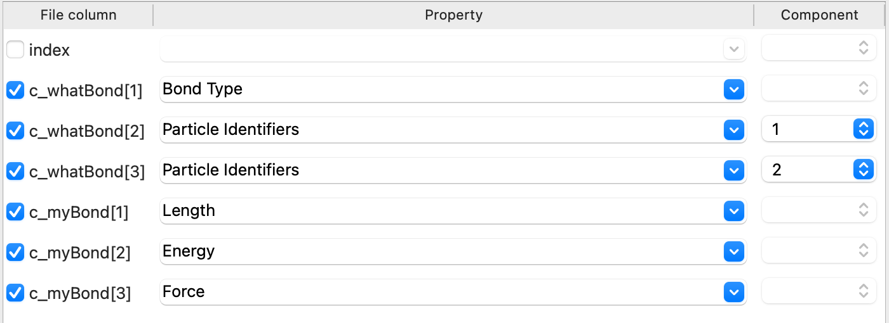

# MP60 - Membrane Interaction

Welcome to the MP60 - Membrane simulation repository! This repository contains all the files and instructions necessary to run a MP60 - membrane simulation. The membrane model is the 3 beads Cooke-Deserno model molecule (DOI:https://doi.org/10.1103/PhysRevE.72.011506). The paper related to this repository can be found at DOI:https://doi.org/10.1101/2025.10.31.685850
---

## Prerequisites

Before running the simulation, ensure you have **specific LAMMPS packages** installed. Follow the instructions in the [`Compile_Correct_LAMMPS.sh`](./Compile_Correct_LAMMPS.sh) file to compile LAMMPS properly. 

If you need support, feel free to reach out to:  
📧 **m.paesani@uva.nl**

---

## Files Included in This Repository

### 1. `MP60_Mem.data`
- **Description**: This file contains the initial positions of individual beads and bond connection information.  
- **Usage**: Use your preferred visualization tool (e.g., **Ovito**, **VMD**, or **PyMol**) to inspect the molecular structure.

### 2. `run_final_npt.in`
- **Description**: The input file to run the overdamped langevin dynamics simulation, in a npt ensemble, of one MP60 molecule and the membrane in a box.  
- **Run Command**:
  ```bash
  lmp -in run_final_npt.in
  ```

### 3. `system.in.init & system.in.settings`
- **Description**: Contains the system initialization and system settings that describe particle interactions.  

### 4. `tabulated_potential.dat`
- **Description**: Contains potential interaction for the Cooke-Deserno model.  

### 5. `muLJ_sig1.725_arep2_aattr3_alpha5_rc4.3125_rmin0.5sig.table & muLJ_sig1.75_arep2_aattr3_alpha5_rc4.375_rmin0.5sig.table `
- **Description**: Contains potential interaction for the the MP-Heads and MP-Tails interactions respectively.  

### 6. `Ovito_Bond_Presets.png`
- **Description**: A helpful image showing the correct settings for loading bond information into Ovito.  
  

Simulations outputs will be a full trajectory and bond description which can be used to visualize the system in full.

---

## Visualization with Ovito

To visualize the simulation in **Ovito**, follow these steps:

1. Import the trajectory file to visualize particle motion.
2. Add the **"Load Trajectory"** modification and load `bonds.txt` for bond information.
3. Apply the bond settings using the provided `Ovito_Bond_Presets.png`.

---

## Additional Notes
- Ensure that LAMMPS is compiled correctly before running the simulation. Refer to the `Compile_Correct_LAMMPS.sh` script.
- For optimal visualization, use Ovito and load the bond information as described above.

---
